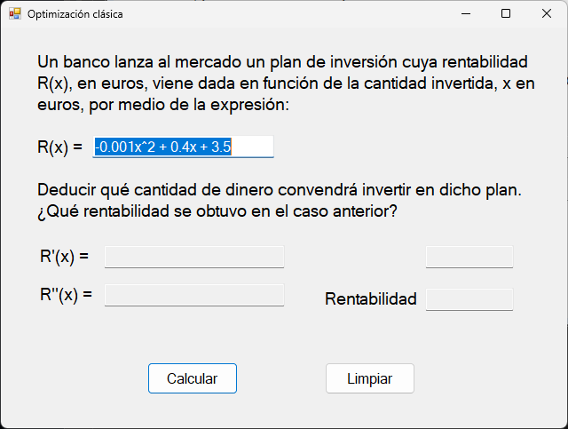

# 🧮 Proyecto optimización tríangular

Este proyecto es una aplicación que resuelva algun problema ya predefinido para que veas como se resuelve una optimización clásica. 

---

## 📷 Captura del Programa

---

## 🛠 Tecnologías usadas

- C# (.NET Framework)
- Windows Forms

---

## 🚀 Cómo ejecutar

1. Abre el proyecto con Visual Studio
2. Compila y ejecuta (F5)
3. Da click en calcular para que veas los resultados del problema planteado

---

## ✍️ Autor

- Carlos Alberto Medina Beltran
